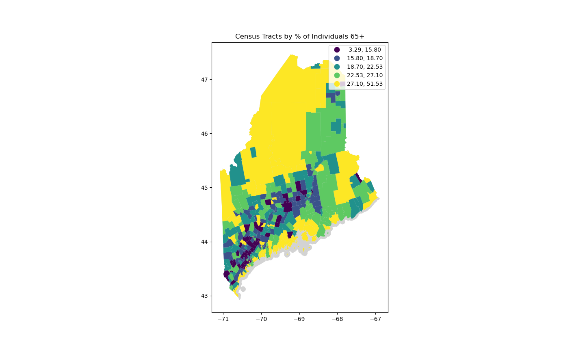

# Team Project for Data Intro Course On Maine Digital Divide Index
Team members: Jake Inger, Jeff Cuartas, Yuan Kuang


# Intro
The availability of high-speed internet has become more crucial for involvement in education, healthcare and employment. In the state of Maine, there are significant variations in broadband accessibility across different regions, with some areas having inadequate or no access to high-speed internet.

This proposed study aims to examine the relationship between socioeconomic status and broadband accessibility in Maine. Specifically, we seek to explore how factors such as income, education, and employment status may influence an individual's access to broadband, as well as how these disparities may vary across different counties in Maine.

Data:
The data sets for this project were pulled from two key sources: broadband data from fcc website and socioeconomic data the American Community Survey (census.gov). Our preliminary EDA demonstrates our accessiblity of the data.

## Description of Results

## Socioeconomic Data

The socioeconomic data for this project was pulled from the Census ACA 5 Year Estimate, 2022. The census data we examined was the following on the census tract level: poverty status in the past 12 months by age, computers in household, sex by age by educational attainment for the population 18 years and over, and sex by age by disability. These data products were pulled in order to create a digital divide index in conjunction with FCC broadband data. Using these socioconment factors along with FCC broadband, we created a metric to highlight digitally underserved areas of Maine.

These datasets were pulled via the [Census API](https://www.census.gov/data/developers/data-sets.html). For each socioeconomic dataset, the data was cleaned and EDA was conducted via distibution plots and choropleth maps.

Since the Census data is from 2022, the overall analysis for this project will provide an accurate assessment of the current state of broadband in the state of Maine.

## Socioeconomic EDA - High Level Analysis

Findings:

- The choropleths and primary EDA indicates regional differences across the state of Maine, specifically a divide between Northern and Southern Maine in key socioeconomic indicatiors such as poverty rates and educational attainment.
- While southern Maine generally performs better in key socieconomic metrics, the EDA reveals greater variety of socioeconomic differences across census tracts which indicates greater degree of inequiety among the population as compared to Northern Maine.

## Socioeconomic EDA - Poverty

Recreate the charts below with

```
make poverty
```


Findings:

- High amount of census tracts with a poverty rate falling between 10% and 20%
- Handful of census tracts have poverty rates of 40% - 50% indicating that there are instances of high need in the state


Additional Findings:

- Lower poverty rates are found in the southern portion of the state, whereas the poverty rate goes up as you travel north
- The yellow areas indicate a poverty rate of at least 17% which is close to 1/5 individuals. Therefore, the poverty rate in these areas is quite high.
- Large geographic swaths of Maine have high poverty rates indicating perhaps systemic/regional challenges.

## Socioeconomic EDA - Educational Attainment

Recreate the charts below with

```
make education
```


Findings:

- Northern Maine tends to have higher rates of individuals without high school educations
- Although southern Maine reports high rates of educational attainment in certain areas, a handle of census tracts reports low rates of educational attaintment indicating discrepencies within the region

## Socioeconomic EDA - computer

Recreate the charts below with

```
make computer
```


## Socioeconomic EDA - disability

Recreate the charts below with

```
make disability
```


## Socioeconomic EDA - age

Recreate the charts below with

```
make age
```



## FCC Data

Pulling from the FCC website, we are able to find the maximum advertised download and upload speeds are determined for each block FIPS code. We can also get information on the types of connectivity whether it is Cable, Copper, and Fiber-to-the-Premises fixed broadband. A column is added that has the maximum speed across all three types is calculated.The DataFrame also includes flags for Non-Broadband (NBBND) and No Internet Access (NIA) based on speed thresholds.


FCC Data: [Colab link](https://colab.research.google.com/drive/1n2vV3qUBbELC7lCu8fXQ1Fj5TnC2G2ys#scrollTo=sszsoZn7yI-E)

## FCC EDA - Logistic Regression


For logistic regression: Accuracy: The proportion of correct predictions out of the total number of predictions. The model has an accuracy of 0.94, meaning that 94% of the predictions were correct.

Macro average: The average of the metric scores for each class, treating all classes equally. The macro average F1-score is 0.48, which suggests that the model has poor performance when considering both classes equally.

Weighted average: The average of the metric scores for each class, weighted by the number of instances in each class. The weighted average F1-score is 0.91, which shows that the model's overall performance is good when considering the class distribution.

In conclusion, the logistic regression model has a high accuracy of 0.94 but performs well only on the majority class (class 0) and poorly on the minority class (class 1). This could be due to an imbalanced dataset, where the majority class dominates the other classes. To improve the model's performance on the minority class, you might consider using techniques like oversampling, undersampling, or using a different algorithm that handles imbalanced datasets better.
